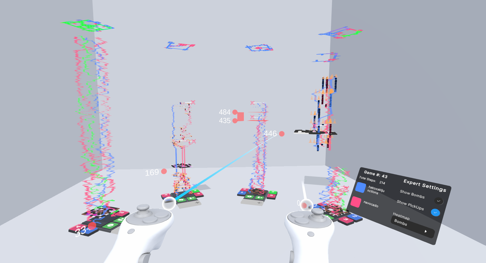

# PomXR

_PomXR_ is a visualization tool designed to analyze spatiotemporal game analytics data from the [Pommerman challange](https://en.wikipedia.org/wiki/Pommerman_Challenge). It allows users to explore agent movements and in-game events through an interactive space-time cube, presented in an XR environment.

The application is developed in Unity and utilizes the OpenXR library for XR support.

## Usage

**Requirements**

- Unity version: 2022.3.30f1
- Target device: Meta Quest 3

**Build (Linux)**

1. Open the project in Unity.
2. Go to: `File > Build Settings`
3. Set the platform to Android if it's not already selected.
4. In the "Scenes in Build" list, add: `Level/Scenes/PomXR-MR`
5. Click _Build_, choose a location, and export the `.apk` file.
6. Sideload the APK to your Quest 3 using e.g. [Sidequest](https://sidequestvr.com/) or adb directly.
