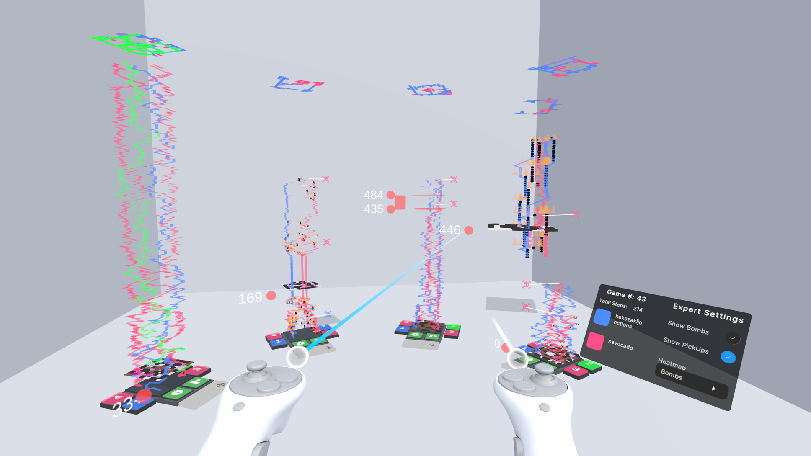

# PomXR

_PomXR_ is a visualization tool for analyzing spatiotemporal game analytics data from the [Pommerman challenge](https://en.wikipedia.org/wiki/Pommerman_Challenge). It allows users to explore agent movements and in-game events via interactive space-time cubes, presented in an XR environment.

The application is developed in Unity and uses the OpenXR library for XR support.

## Requirements

- **Unity version:** 2022.3.30f1
- **Target device:** Meta Quest 3
(Also tested with Meta Quest Pro)

## Build Instructions (Linux workflow)

1. Open the project in Unity.
2. Go to: `File > Build Settings`.
3. Set the platform to Android (if not already).
4. In the "Scenes in Build" list, add: `Level/Scenes/PomXR-MR`
5. Click _Build_, choose a location, and export the `.apk` file.
6. Sideload the APK to your Quest 3 using e.g. [SideQuest](https://sidequestvr.com/) or adb directly.
